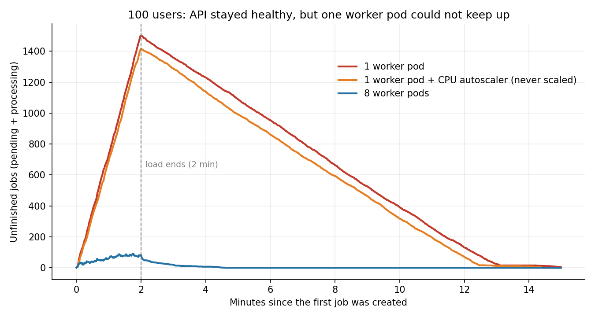
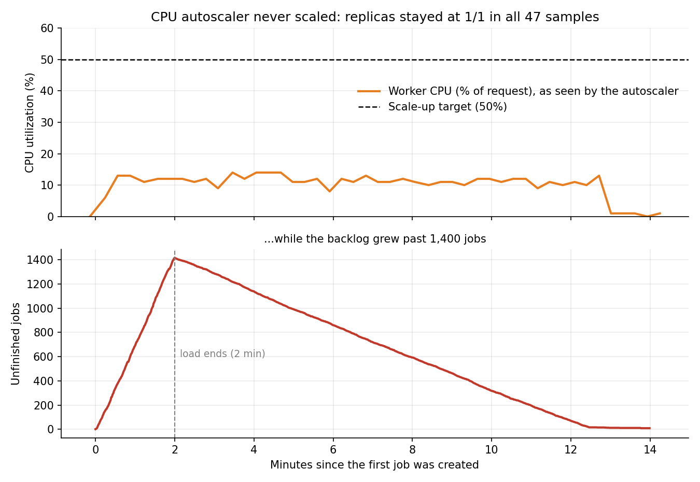
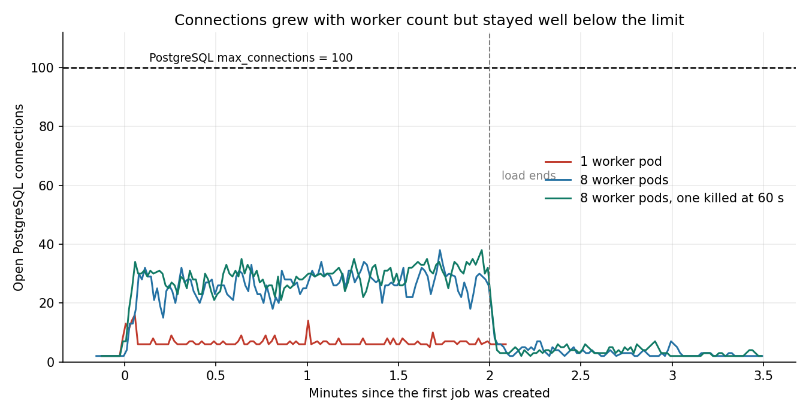
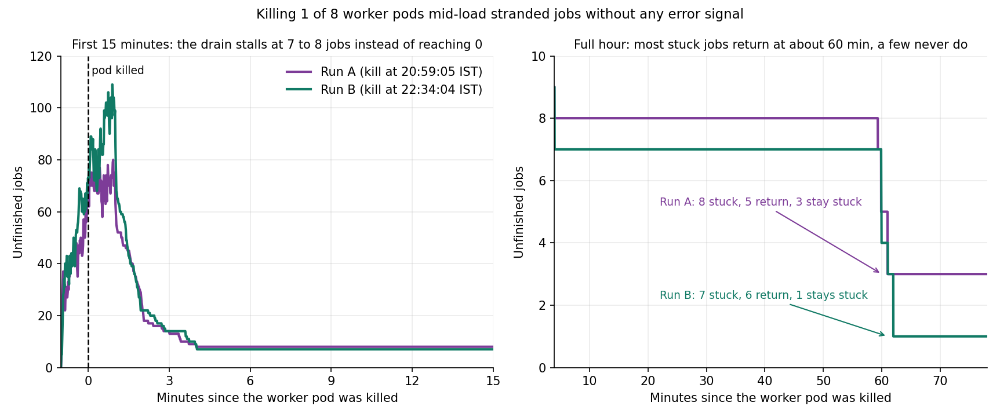

# JobQueue on AWS EKS: load testing, autoscaling and worker-failure behaviour

JobQueue is an asynchronous job-processing system: a Django REST API, Celery workers, a Redis broker and PostgreSQL. This document covers deploying it on Amazon EKS (Elastic Kubernetes Service) and six Locust test runs (plus a short tooling check) against it on 2026-10-04.

An earlier local investigation (PostgreSQL connection exhaustion at 150 users, fixed with PgBouncer) is documented separately. The EKS runs below use 100 users and do **not** reproduce or re-test that finding.

## Summary

1. **A healthy API can hide a saturated worker tier.** At 100 users, one worker pod (4 processes) left the API at 0% errors and p95 of 51 to 57 ms, while 1,417 to 1,502 jobs were unfinished when the load stopped and jobs waited 250 to 334 s on average (chart 1).
2. **A CPU-based autoscaler never reacted.** The worker Horizontal Pod Autoscaler (HPA, target 50% CPU, max 8) stayed at 1 replica in all 47 samples, because worker CPU sat at 6 to 14% during the load while the queue grew (chart 2). The jobs are simulated sleeps, so they are I/O-like; real CPU-bound jobs would behave differently.
3. **Scaling workers manually to 8 removed the backlog** (peak 92 unfinished jobs, average queue delay 0.14 to 0.28 s). Peak PostgreSQL connections rose from 16 to 21 (1 pod) to 34 to 48 (8 pods) (chart 3). The 100-connection limit was not reached, and scaling beyond 8 pods was not tested.
4. **Killing one worker pod mid-load stranded jobs with no error signal, in both runs (7 to 8 of about 1,750 jobs, 0.4 to 0.5%).** The API stayed at 0% errors and Kubernetes replaced the pod within about 15 s. About an hour later Redis redelivered most of the stranded jobs (11 of 15 across the two runs); 4 (0.11% of all jobs) never completed (chart 4). A kill after the load had ended lost nothing.

## Environment

| Item | Value |
|---|---|
| Cluster | EKS in `eu-north-1`, 3 managed `t3.medium` nodes, Kubernetes v1.34 |
| Image | Python 3.8-slim, non-root user, one image for all components (Django 4.2.13, Celery 5.3.6, redis-py 5.0.3, psycopg2-binary 2.9.10) |
| web | 1 replica, Django `runserver` (development server), LoadBalancer Service; readiness probe on `/health/` |
| worker | Celery prefork, concurrency 4, queues `jobs.high`, `jobs.default`, `jobs.low`; 1 or 8 replicas as stated |
| PostgreSQL | Version 12, `max_connections=100` (default), data on `emptyDir` (not persistent) |
| Redis | Version 7 |
| web / worker resources | requests 250m CPU and 256Mi; limits 500m CPU and 512Mi |
| Load generator | Locust 2.32.0 as an in-cluster Kubernetes Job |

## Method

- **Workload:** the locustfile mixes four job types (`email_send`, `report_gen`, `data_process`, `image_resize`) and three priorities. Task weights are 3 create, 5 poll, 1 stats, 1 health, with 1 to 3 s think time. Jobs are simulated with sleeps. `data_process` fails 20% of first attempts by design and retries after 60 s, then 120 s.
- **Load profile:** 100 users, spawn rate 20 per second, 120 s. One variable changed per run.
- **Queue delay** is measured on first attempts only (`retry_count = 0`). Otherwise the retry backoff inflates every average regardless of load.
- **Integrity check:** after load stops, wait until no job is `pending` or `processing` (up to 15 minutes), then count job statuses. Dead-lettered jobs are expected (about 0.8% of `data_process`); the check is created = completed + dead-lettered + stranded.
- **Collected per run:** Locust summary and raw CSV, PostgreSQL connection stats, Redis queue depth, pod and node CPU/memory, replica and HPA state, PostgreSQL log, cluster events, and job statuses from the database.

## Results

| Run | Configuration | Requests (failures) | API p95 / p99 | Peak unfinished jobs | Avg queue delay, first attempts | Job outcome |
|---|---|---|---|---|---|---|
| 1 | 1 worker pod (`users100`) | 5,673 (0) | 51 / 160 ms | 1,502 at end of load; 919 still unfinished 4 min later | 293 to 327 s (p95 551 to 622 s), from the final export | 1,765 completed + 3 dead-lettered = 1,768 |
| 2 | 1 worker pod + CPU autoscaler, never scaled (`hpa-cpu`) | 5,618 (0) | 57 / 250 ms | 1,417 at end of load; drained in about 12 min | 250 to 334 s (p95 480 to 610 s) | 1,674 + 2 = 1,676 |
| 3 | 8 worker pods (`workers8`) | 4,958 (0) | 57 / 190 ms | 92 (in flight and waiting to retry) | 0.14 to 0.28 s (p95 0.65 to 1.26 s) | 1,684 + 5 = 1,689 |
| 4 | 8 workers, 1 pod killed 38 s after load ended (`kill-worker`) | 4,868 (0) | 52 / 160 ms | 85; drained normally | 0.19 to 0.28 s | 1,734 + 3 = 1,737 |
| 5 | 8 workers, 1 pod killed 60 s into load, run A (`kill-worker2`) | 4,866 (0) | 81 / 730 ms (max 1.6 s) | about 80; 8 never finished within 15 min | 0.16 to 0.32 s (at the 15-minute mark) | 1,727 + 2 dead-lettered + **8 stranded** = 1,737; about 1 h later: 1,732 + 2 + 3 still stuck |
| 6 | Same as run 5, repeated, run B (`kill-worker3`) | 5,089 (0) | 64 / 290 ms (max 719 ms) | 109; 7 never finished within 15 min | 0.31 to 0.48 s (p95 1.34 to 2.11 s; at the 15-minute mark) | 1,758 + 4 dead-lettered + **7 stranded** = 1,769; about 1 h later: 1,764 + 4 + 1 still stuck |

Runs are numbered in the order of this write-up, not the order they were executed (`workers8` ran before `hpa-cpu`); the folder names in `results/` identify each run unambiguously. "Peak unfinished jobs" is computed from the job timestamps in `results/jobs_export.csv` (jobs created but not yet completed, including jobs waiting to retry). Queue delay is the range of group averages (job type by priority) over first attempts only. For runs 5 and 6 it is measured at the end of the 15-minute wait, so the jobs Redis redelivered an hour later are excluded; including them raises the worst group average to about 23 to 25 s.

## Charts

Other measurements:

- Peak PostgreSQL connections: 6 (smoke test), 16 (run 1), 21 (run 2), 38 (run 3), 34 (run 4), 48 (run 5), 38 (run 6). Going from 4 to 32 worker processes added roughly 13 to 32 connections (about 21 on average), fewer than one per process. A linear extrapolation puts the 100-connection limit at very roughly 20 to 45 worker pods (a wide range, because run-to-run spread is large); this was not tested. No "too many clients" errors in any run.
- Run 2: worker CPU 6 to 14% of its request against a 50% target; replicas `1/1` in all 47 samples. The backlog drained at about 2 jobs/s, consistent with an estimated capacity of about 2 jobs/s per worker pod (average processing time about 1.65 s across 4 processes).
- Redis queue depth peaked at 1,481 (run 1) and 1,396 (run 2) and stayed at 0 in every 8-pod run, even while jobs were stranded. Jobs held inside workers (running, or waiting to retry) are not in the Redis list, so database status counts are the more reliable backlog signal.
- Priority queues gave a modest advantage under saturation (run 2: about 250 to 279 s for `high` vs 315 to 334 s for `low`), which is not meaningful protection for high-priority work. One run per configuration.
- Replacement worker pods were back to 8/8 within about 13 s (run 4), 14 s (run 5) and 15 s (run 6). Workers have no readiness probe, so this means the container started, not that Celery had reconnected.
- The slowest requests in every run with a per-request CSV were about 420 to 750 ms, mostly in the first seconds while 100 users arrived at once.

### Worker crash under load (runs 5 and 6)

One worker pod was force-deleted 60 s into the load in each run (run 5 at 20:59:05 IST, run 6 at 22:34:04 IST). The timestamp is taken just before the delete command, so the pod may have lived a second or two longer. Both runs ended with a few jobs unfinished after a 15-minute wait, with no error anywhere in the API:

| Class of stranded job | Run 5 | Run 6 |
|---|---|---|
| `data_process` waiting out a 60 s retry (`processing`, `retry_count=1`), held in the killed pod's memory | 4 | 6 |
| `report_gen` mid-execution (`processing`, `retry_count=0`), started 0 to 1 s before the kill | 2 | 0 |
| Created at or just after the kill and never started (`pending`) | 2 | 1 |
| **Total stranded at 15 minutes** | **8** | **7** |

Follow-up about one hour after each kill:

| | Run 5 | Run 6 |
|---|---|---|
| Redis unacknowledged messages at 15 minutes | 5 | 6 |
| Completed on their own, 59 to 62 minutes after the kill | 5 | 6 |
| Never completed | 3 | 1 |
| Redis unacknowledged messages afterwards | 0 | 0 |

Across both runs: 3,506 jobs, 15 stranded at 15 minutes (0.43%), 11 returned after about an hour (0.31%), 4 never completed (0.11%).

The application sets none of `acks_late`, `reject_on_worker_lost`, `visibility_timeout` or a prefetch override in its `config` and `jobs` code, so it uses Celery defaults. My working explanation, consistent with the data but not proven: Celery acknowledges a task when it starts, so a task running at the moment of the kill is gone for good; messages a worker has received but not started stay unacknowledged in Redis until the visibility timeout (one hour by default) expires, then are redelivered. The redelivery times (59 to 62 minutes) fit that.

The jobs that never came back differ between the runs. Run 5: two `report_gen` jobs killed mid-execution, and one never-started `data_process` job that was not in Redis's unacknowledged set. Run 6: one retry-waiter whose failure was recorded (`retry_count=1`) but whose retry may not have been scheduled before the pod died. Both explanations are unverified. Redis queue depth stayed at 0 throughout both runs, so only the database status counts revealed the loss.

## Limitations

- Jobs are simulated (sleeps, a fixed failure rate). Results describe this platform and configuration, not real email, report or image workloads.
- The web tier runs the Django development server, and PostgreSQL is a single instance on non-persistent storage.
- One run per configuration (two for the mid-load kill), so small differences (for example p95 51 vs 57 ms) are not meaningful. `t3` instances are burstable.
- Run 5's tail-latency rise (p99 160 to 730 ms, max 1.6 s) is unexplained: its per-request CSV (and run 2's) was lost to a runner bug. In run 6 the p99 was 290 ms and the slowest requests fell in the last two seconds of the load, not near the kill, so there is no evidence that the kill adds latency.
- Peak connections of 48 (run 5) and 38 (run 6) occurred at the very end of the load, not near the kill; the cause was not determined.
- An AWS console sign-out during run 6 left a gap of about 10 minutes in the pod, node and replica samples. The test itself was unaffected.
- Queue delay covers jobs that started. Jobs that never started (the stranded ones) are not in it.
- The PostgreSQL 100-connection ceiling was not reached on EKS, and PgBouncer and web scale-out were not tested here.

## Not done yet (next steps, not results)

- Scale workers on queue depth (for example KEDA, Kubernetes Event-driven Autoscaling) instead of CPU.
- Test `acks_late` with `reject_on_worker_lost`. This requires idempotent tasks, because late acknowledgement can run a task twice (an `email_send` could send two emails).
- Add PgBouncer in the cluster and test worker scale-out against the connection ceiling.
- Run the web tier on gunicorn, and consider a separate worker Deployment per priority queue.

## Reproducing

`scripts/run_test.sh <name> <users> <spawn_rate> <seconds> [kill_after_seconds]` starts the loggers, runs Locust as a Job, waits for the queue to drain, and collects everything into `results/<name>/`. Manifests are in `manifests/`, the locustfile and monitoring scripts in `scripts/`, and raw results in `results/` (one folder per run, plus `jobs_export.csv`, the full jobs table without payloads and with a `run` column assigned from each run's start time, and `run_index.csv` with each run's start time). `stranded_check.txt` in the run 5 and run 6 folders holds the follow-up checks. `scripts/make_charts.py` regenerates the charts from `results/` when run from the repository root. Account-specific values (the ECR image URI) are replaced with `<ACCOUNT_ID>`.
